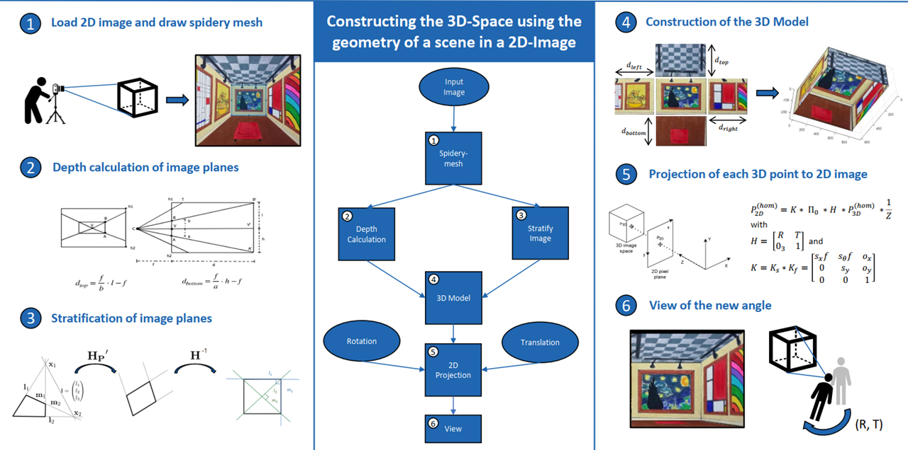

# CV2022Challenge Group 47: Maximilian Studt, Sahil Salotra, Dionysios Mitsios, Leyong Loh, Benjamin Meene

## Short description

Based on the Spidery Mesh which is created by the user input of the rear plane and the vanishing point, the program transforms the two-dimensional input image into a three-dimensional model. 
This is done by first splitting the input picture into five planes (rear, left, top, right, bottom), and then rectifying all of the side planes.
Combining the five rectified planes in a perpendicular way creates the 3D model.
A "virtual camera" which can be rotated and translated relative to the 3D model, enables to project the coordinates of each of the five planes onto the camera pixel plane to simulate the tour into the picture.

## User Manual

### Launch the app
Run "main.m" to open the app.

### Step 1: Load image
Press "upload image" button and select an image to upload.

### Step 2: Spidery Mesh
* First draw the background of the image
* Then draw the vatage point
* Use "Save" to draw the spidey mesh and save your options
* Use "Reset" to redraw the background and vantage point
Optional: Specify the focal lengh of the camera 

### Step 3: View function
* Tx: Move to the right (positive) or to the left (negative)
* Ty: Move down (positive) or up (negative) 
* Tz: Move forward into the picture (positive) or backwards (negative)

The translation values are given in percentages, where 0% means no translation from the camera center the picture was originally taken from. 100% means a translation of 100% of the image size.

The positive translation in z-direction is limited to +100% since a further movement into the picture would set the camera behind the background plane.
All other translation values are limited to +/-200%.

* a_x: Rotate around the horizontal x-axis - tilt camera upwards (positive) or downwards (negative)
* a_y: Rotate around the vertical y-axis - turn camera to the right (positive) or to the left (negative)
* a_z: Rotate around the z-axis (which goes into the picture) - tilt camera to the right=tilt image to the left (positive) or tilt camera to the left=tilt image to the right (negative)

The rotation angle values are given in degrees, and limited to +/-45 degrees to improve the output image quality.

## Required Toolboxes
* Computer Vision Toolbox
* Image Processing Toolbox

